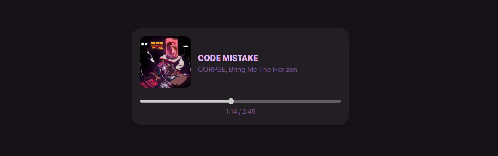

***
# ❇️ Spotify player/widget
### Why?
As often, I couldn't sleep so I thought about a webpage where I can see what I'm currently listening (which is kind of idiot), and then I remembered that my parents were curious about what I'm listening far from their home. That's why I made this, so that they can sometimes go to a self-hosted webpage and see what I'm listening to.
### How?
This is a two-in-one project:
- **Front-end part:** the code for the client, the humans who will browse to the website. (HTML + CSS + JS)
- **Back-end part:** the code running on a server that sends API requests to Spotify and process the data. (TypeScript)
***
# 📦 Dependencies
## 📡 Back-end part

You must run the `server.tsx` with [Deno](https://deno.com/) after installing [query-string](https://www.npmjs.com/package/query-string) with the following command:
```bash
npm i query-string
```
***
# 🖥️ Installation
1. Host the `server.tsx` script on a HTTP server.
> [!TIP]
> I personnaly chose [Val Town](https://www.val.town/) since it is a free hosting website for JS and TS snippets of code. Moreover, the website is very simple and allow you to create environnement variables easily.
2. Go to [Spotify for Developpers](https://developer.spotify.com/dashboard), connect your account and create an app.
3. Store your credentials into a Environment variable file (see `.env` file: [/server/.env](/server/.env)). These credentials are on the dashboard of your all new Spotify app.
> [!NOTE]
> If properly configured, play some music on Spotify and go toyour HTTP with its URL. You should land on a page showing a JSON dictionnary showing you informations about your currently listening track
<details>
<summary>Click here to see if you configured properly</summary>

You should see on your server's website:
```json
{
    "duration_ms":165303,
    "progress_ms":9265,
    "shortenedName":"CODE MISTAKE",
    "link":"https://open.spotify.com/track/39iRz0h1eZOyXzch8tKQit",
    "artistNames":["CORPSE","Bring Me The Horizon"],
    "artistLinks":["https://open.spotify.com/artist/7yntSJ6uojO3z6GFUVwhAW","https://open.spotify.com/artist/1Ffb6ejR6Fe5IamqA5oRUF"],
    "image":"https://i.scdn.co/image/ab67616d0000b27321ebe09152409f7272dead52"
}
```
</details>

4. Grab your server URL and paste it into the `web()` function in [client/web.js](client/web.js)

You can now open your `main.html` and view your current music track.
***